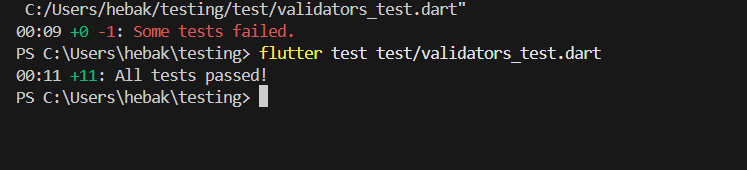
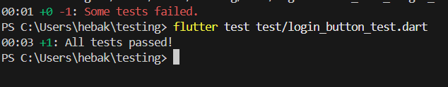

# Flutter Testing Laboratory

## Overview
This project is part of the Flutter Testing Laboratory Assignment, which includes three main tasks:
1. Unit testing for validation functions.
2. Widget testing for the registration form.
3. Widget testing for the login button.

---

## Task 1: Validators (Unit Testing)
### Description
Implemented a Validators class to validate email, password, and confirm password fields.  
Added unit tests to check valid and invalid cases.

### Test Command
```bash
flutter test test/validators_test.dart

### Screenshots

| Validators Test | Registration Form Test |
|-----------------|------------------------|
|  |  |

## Task 2: Registration Form (Widget Testing)

### Description

Created a RegistrationForm widget that includes:
	•	Email, password, and confirm password fields.
	•	Validation and a submit button that shows a success message.


## Task 3: Login Button (Widget Testing)

### Description

Built a simple LoginButton widget using ElevatedButton.
Test verifies that:
	•	The button text is correct.
	•	The callback runs when pressed.
